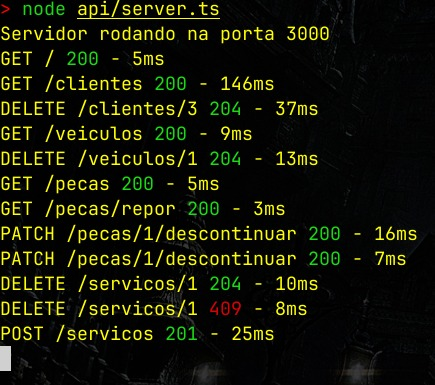
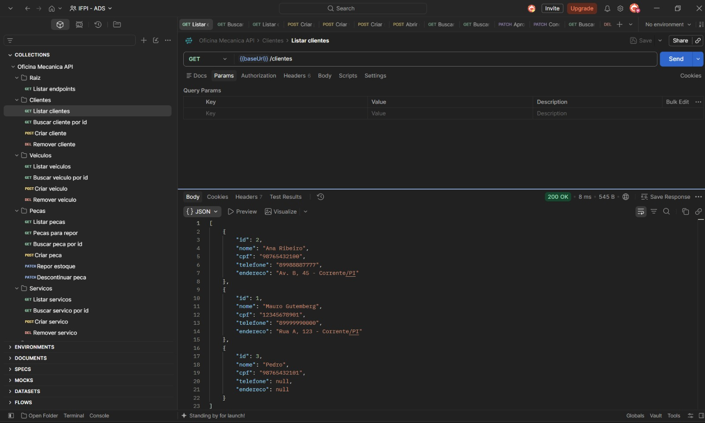

> **Esta é a branch `api`.** Ela existe pra quem quer só a API — sem o CLI em Dart nem o app mobile em Flutter, que ficam na branch [`main`](../../tree/main). Clone/checkout só essa branch se o que você quer é rodar ou integrar com a API de Serviços Mecânicos:
> ```bash
> git clone --branch api --single-branch <url-do-repo>
> ```

# Atividade 1 - Programação pra Dispositivos Móveis

Aplicação do aprendizado da linguagem dart para desenvolver uma aplicação crud em dart, com o o objetivo de praticar a criação de classes, métodos, atributos e a manipulação de dados.

O trabalho consiste em desenvolver um sistema de oficina mecânica, que permita o cadastro de clientes, veículos, peças e serviços, além de gerenciar ordens de serviço e estoque.

## Aluno Responsável
Mauro Gutemberg Magalhães Barros

## Sistema escolhido
Sistema 4 - Oficina Mecânica

---
```
4. 🔧 Sistema de Oficina Mecânica
A oficina mantém um estoque de peças de diferentes marcas, valores e quantidades.
Eventualmente uma peça esgota e atinge o ponto de reposição, ou é descontinuada;
novos itens são adquiridos e há diversos serviços oferecidos, cada um com seu valor de mão de obra,
sendo necessário manter o cadastro de peças e serviços sempre atualizado.

Os clientes trazem seus veículos para reparo.
Primeiro é necessário cadastrá-los e registrar os veículos vinculados.
Depois, o veículo é avaliado e abre-se uma Ordem de Serviço (OS) com o diagnóstico inicial,
o valor varia conforme as peças necessárias e as horas de mão de obra. Antes de iniciar,
a oficina apresenta o orçamento, que o cliente precisa aprovar;
apenas as peças aprovadas e disponíveis em estoque são reservadas.

Ao finalizar, define-se a OS como concluída, registra-se data/hora de entrega e dá-se baixa no
estoque das peças usadas, somando peças + mão de obra. Se durante a execução surgirem problemas
adicionais, eles vão para nova aprovação e somam ao total;
se um serviço orçado não for necessário, seu valor é descontado do total final.
```
---

## Stack

* **Express 5** + **TypeScript**, rodando direto via `node --experimental-strip-types` (sem passo de build — os `.ts` da API são executados como estão)
* **Prisma 7** como ORM, com o `@prisma/adapter-mariadb` (driver adapter nativo, sem depender do client MySQL do sistema)
* **MariaDB** como banco
* Middleware de log próprio (`api/middleware_logger.ts`), colorindo por faixa de status (2xx verde, 3xx ciano, 4xx/5xx vermelho) e medindo a duração de cada requisição

## Modelo de dados

Definido em `prisma/schema.prisma`, cinco entidades principais mais duas tabelas de associação:

* **Cliente** — `nome`, `cpf` (único, 11 chars), `telefone?`, `endereco?`; um cliente tem vários `Veiculo`.
* **Veiculo** — `modelo`, `ano`, `placa` (única), `clienteId`; um veículo tem várias `Ordem`.
* **Peca** — `marca`, `valor` (Decimal 10,2), `quantidade` (default 0), `pontoReposicao` (default 0), `descontinuada` (default false).
* **Servico** — `nome`, `valor` (Decimal 10,2), `descricao?`.
* **Ordem** — `veiculoId`, `valorTotal` (calculado na abertura), `status` (`aberta` → `aprovada` → `concluida`), `dataHoraAbertura` (default now), `dataHoraConclusao?`.
* **OrdemPeca** / **OrdemServico** — tabelas de associação (chave composta `ordemId`+`pecaId`/`servicoId`) que guardam a **quantidade** e o **`valorUnitario` congelado no momento da abertura** da ordem — reajustes de preço em `Peca`/`Servico` depois não afetam ordens já abertas.

## Endpoints

A API sobe em `http://localhost:3000`. Todas as respostas são JSON; erros vêm no formato `{ "erro": "mensagem" }`. `GET /` lista os endpoints disponíveis em HTML.

### Clientes

| Método | Rota | Corpo | Sucesso | Erros |
|---|---|---|---|---|
| GET | `/clientes` | — | 200, lista ordenada por nome | |
| GET | `/clientes/:id` | — | 200, cliente com `veiculos` incluídos | 404 se não existe |
| POST | `/clientes` | `{ nome, cpf, telefone?, endereco? }` | 201, cliente criado | 400 se faltar `nome`/`cpf`; 409 se o `cpf` já existe |
| DELETE | `/clientes/:id` | — | 204 | 409 se o cliente tem veículos cadastrados |

### Veículos

| Método | Rota | Corpo | Sucesso | Erros |
|---|---|---|---|---|
| GET | `/veiculos` | — | 200, lista com `cliente` incluído | |
| GET | `/veiculos/:id` | — | 200, veículo com `cliente` e `ordens` incluídos | 404 se não existe |
| POST | `/veiculos` | `{ modelo, ano, placa, clienteId }` | 201, veículo criado | 400 se faltar algum campo; 409 se `clienteId` não existe, ou se a `placa` já existe |
| DELETE | `/veiculos/:id` | — | 204 | 409 se o veículo tem ordens |

### Peças

| Método | Rota | Corpo | Sucesso | Erros |
|---|---|---|---|---|
| GET | `/pecas` | — | 200, lista ordenada por marca | |
| GET | `/pecas/repor` | — | 200, peças ativas com `quantidade <= pontoReposicao` | |
| GET | `/pecas/:id` | — | 200 | 404 se não existe |
| POST | `/pecas` | `{ marca, valor, quantidade?, pontoReposicao? }` | 201 (`quantidade`/`pontoReposicao` default 0) | 400 se faltar `marca`/`valor` |
| PATCH | `/pecas/:id/repor` | `{ quantidade }` | 200, `quantidade` incrementada | 400 se `quantidade <= 0`, se a peça não existe ou está descontinuada |
| PATCH | `/pecas/:id/descontinuar` | — | 200, marca `descontinuada: true` | 404 se não existe |

> `GET /pecas/repor` precisa vir registrado **antes** de `GET /pecas/:id` nas rotas, senão o Express interpreta "repor" como um `:id`.

### Serviços

| Método | Rota | Corpo | Sucesso | Erros |
|---|---|---|---|---|
| GET | `/servicos` | — | 200, lista ordenada por nome | |
| GET | `/servicos/:id` | — | 200 | 404 se não existe |
| POST | `/servicos` | `{ nome, valor, descricao? }` | 201 | 400 se faltar `nome`/`valor` |
| DELETE | `/servicos/:id` | — | 204 | 409 se o serviço já foi usado em alguma ordem |

### Ordens de serviço

| Método | Rota | Corpo | Sucesso | Erros |
|---|---|---|---|---|
| GET | `/ordens` | — | 200, lista com `veiculo`, `itens.peca` e `servicos.servico` incluídos, mais recentes primeiro | |
| GET | `/ordens/:id` | — | 200, com as mesmas relações incluídas | 404 se não existe |
| POST | `/ordens` | `{ placa, itens?: [{ pecaId, quantidade }], servicoIds?: number[] }` | 201, ordem `aberta` | 400 se faltar `placa`, se não houver nenhum item/serviço, se o veículo/peça/serviço não existir, se alguma peça estiver descontinuada ou sem estoque suficiente |
| PATCH | `/ordens/:id/aprovar` | — | 200, `aberta` → `aprovada` | 400 se a ordem não existe ou não está `aberta` |
| PATCH | `/ordens/:id/concluir` | — | 200, `aprovada` → `concluida`, grava `dataHoraConclusao` | 400 se a ordem não existe ou não está `aprovada` |
| DELETE | `/ordens/:id` | — | 204, cancela e devolve as peças reservadas ao estoque | 400 se a ordem não existe ou já está `concluida` |

## Regras de negócio

A camada de regras fica isolada em `api/service.ts`, sem lógica de negócio nas rotas (`api/routes.ts` só valida entrada e traduz erros em status HTTP). Os pontos que exigem mais cuidado:

* **Abertura de ordem é transacional** (`prisma.$transaction`): valida o veículo, cada peça (existe, não está descontinuada, tem estoque suficiente) e cada serviço **antes** de alterar qualquer estoque; calcula `valorTotal` somando peças + mão de obra; congela o `valorUnitario` de cada item no momento da abertura; só então dá baixa no estoque. Se qualquer validação falhar, nada é gravado.
* **Cancelamento também é transacional**: devolve a quantidade de cada `OrdemPeca` ao estoque antes de apagar a ordem.
* **Transições de status são estritas**: só é possível aprovar uma ordem `aberta`, só é possível concluir uma `aprovada`, e não dá pra cancelar uma `concluida`.
* **Integridade referencial verificada manualmente**: remover cliente com veículos, veículo com ordens, ou serviço já usado numa ordem retorna 409 em vez de deixar o banco quebrar por causa de FK.
* **Peça descontinuada não pode ser reposta nem entrar numa nova ordem**, mas continua listada (pra manter histórico).

## Como executar

Pré-requisitos: Node.js (com suporte nativo a TypeScript — usado aqui via `node api/server.ts` direto, sem `tsx`/`ts-node`) e MariaDB instalados.

```bash
# 1. dependências
npm install

# 2. banco de dados (no MariaDB)
CREATE DATABASE oficina CHARACTER SET utf8mb4 COLLATE utf8mb4_unicode_ci;

# 3. variáveis de ambiente
cp .env.example .env   # e preencha os valores

# 4. tabelas e client do Prisma
npx prisma migrate dev

# 5. servidor
node api/server.ts
```



## Testando a API

### Collection do Postman

O arquivo `oficina.postman_collection.json` traz todos os endpoints prontos, agrupados por recurso e com corpos de exemplo já preenchidos.

Para usar: no Postman, **Import** → selecione o arquivo. A URL base fica na variável `{{baseUrl}}` da collection, com valor padrão `http://localhost:3000`.

Sugestão de ordem para um teste completo, já que os recursos dependem uns dos outros:

1. Criar cliente
2. Criar veículo (usando o `id` do cliente em `clienteId`)
3. Criar peça e criar serviço
4. Abrir ordem (com a `placa` do veículo e o `pecaId` da peça)
5. Listar peças — a quantidade deve ter caído, confirmando a baixa no estoque
6. Aprovar ordem e depois concluir ordem

Vale testar também os caminhos de erro, que é onde as regras de negócio aparecem: concluir uma ordem ainda não aprovada (400), abrir ordem com quantidade acima do estoque (400), cadastrar CPF repetido (409), remover cliente que possui veículos (409).



### Script de limpeza do banco

O `limpar-banco.sh` esvazia as tabelas entre uma bateria de testes e outra, sem precisar recriar o banco na mão.

```bash
chmod +x limpar-banco.sh   # só na primeira vez

./limpar-banco.sh          # esvazia as tabelas
./limpar-banco.sh --seed   # esvazia e insere dados de exemplo
./limpar-banco.sh --reset  # derruba tudo e reaplica as migrations
```

O modo padrão usa `TRUNCATE`, que também reinicia os ids em 1 — assim os exemplos da collection do Postman continuam válidos a cada rodada.

O `--seed` deixa o banco com 2 clientes, 2 veículos, 3 peças e 3 serviços. Os dados foram escolhidos para exercitar as regras: uma das peças já está abaixo do ponto de reposição (aparece em `/pecas/repor`) e outra está descontinuada (deve ser recusada ao abrir uma ordem).

O `--reset` chama o `prisma migrate reset` e é o modo a usar depois de alterar o `schema.prisma`.

O script lê as credenciais do `.env`, então ele depende do arquivo estar preenchido.

---

## Clientes desta API

O CLI em Dart e o app mobile em Flutter que consomem esta API (com CRUD completo pra todas as entidades acima) ficam na branch [`main`](../../tree/main) deste repositório — esta branch (`api`) traz só o backend.

---
packages utilizados
```
atividade_ppdm@1.0.0 /home/maurogutmb/ifpi/Atividade_ppdm
├── @prisma/adapter-mariadb@7.10.0
├── @prisma/client@7.10.0
├── @types/express@5.0.6
├── @types/node@26.5.1
├── dotenv@17.4.2
├── express@5.2.1
├── mysql2@3.24.4
├── prisma@7.10.0
├── tsx@4.23.13
└── typescript@7.0.2
```
